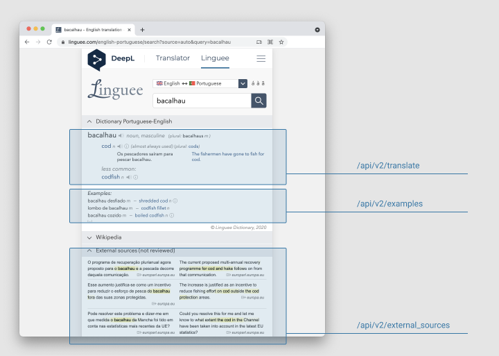

# Linguee API

[Linguee](https://linguee.com) provides excellent dictionary and translation memory service. Unfortunately, there is no way you can get automated access to it. Linguee API fixes the problem. It acts as a proxy and converts their HTML responses to easy-to-use JSON API.

## API endpoints

The proxy provides three API endpoints: for translations, for examples, and external sources.

The API documentation and the playground is available for the sample installation:

- [Documentation and API playground](https://linguee-api-v2.herokuapp.com/docs)
- [The same documentation, but formatted with ReDoc](https://linguee-api-v2.herokuapp.com/redoc)

## Sample installation

Sample installation is available at https://linguee-api-v2.herokuapp.com.

- Get translations of the word "bacalhau" from Portuguese to English: [https://linguee-api-v2.herokuapp.com/api/v2/translate?query=bacalhau&src=pt&dst=en](https://linguee-api-v2.herokuapp.com/api/v2/translate?query=bacalhau&src=pt&dst=en).
- Get a list of curated examples: [https://linguee-api-v2.herokuapp.com/api/v2/examples?query=bacalhau&src=pt&dst=en](https://linguee-api-v2.herokuapp.com/api/v2/examples?query=bacalhau&src=pt&dst=en).
- Get examples from external sources: [https://linguee-api-v2.herokuapp.com/api/v2/external_sources?query=bacalhau&src=pt&dst=en](https://linguee-api-v2.herokuapp.com/api/v2/examples?query=bacalhau&src=pt&dst=en).

## Supported languages

API supports all the languages, supported by Linguee. As in Linguee, not all language pairs are valid though. Supported languages:
`bg` (Bulgarian), `cs` (Czech), `da` (Danish), `de` (German), `el` (Greek), `en` (English), `es` (Spanish), `et` (Estonian), `fi` (Finnish), `fr` (French), `hu` (Hungarian), `it` (Italian), `ja` (Japan),`lt` (Lithuanian), `lv` (Latvian), `mt` (Maltese), `nl` (Dutch), `pl` (Polish), `pt` (Portuguese), `ro` (Romanian), `ru` (Russian), `sk` (Slovak), `sl` (Solvene), `sv` (Swedish), `zh` (Chinese).

## Response structure

**Lemmas**

Every query (a random string) can match several so-called lemma objects.

According to Wikipedia, [lemma](https://en.wikipedia.org/wiki/Lemma_(morphology)) is the canonical form, dictionary form, or citation form of a set of words.

In English, for example, break, breaks, broke, broken, and breaking are forms of the same lexeme, with "break" as the lemma by which they are indexed.

In the API, lemmas have the only required attribute, "text," but may have optional elements, such as part of speech ("pos") and audio links with pronunciations.

**Translations**

Every lemma has one or more translations. The translation is a lemma in a different language and has a similar structure with the necessary text field and optional part of speech and audio links.

**Examples**

In addition to lemmas, the API returns several usage examples curated by dictionary authors. Examples are the short phrases, annotated with one or more equivalents in different languages. When appropriate, examples may contain the part-of-speech form and audio links.

**External Sources**

On top of curated examples, Linguee provides links to external sources. The API returns objects containing the phrase snipped in the original language and an equivalent snippet in the translation.

## Wait, Python? What happened to the Golang version?

I wrote the first version of the proxy in Go. I quickly learned that having a project in a language that I'm not totally fluent, makes me feel less enthusiastic about the development. Eventually, I decided to scratch it and create the second version in Python and FastAPI.

The code for the previous Golang version is still available [in a separate branch](https://github.com/imankulov/linguee-api/tree/golang).

## Terms and Conditions

If you use the API, make sure you comply with
[Linguee Terms and Conditions](http://www.linguee.com/page/termsAndConditions.php),
and in particular with that clause:

> Both private and business usage of linguee.com services is free of charge.
> It is however strictly prohibited to forward on our services to third
> parties against payment
